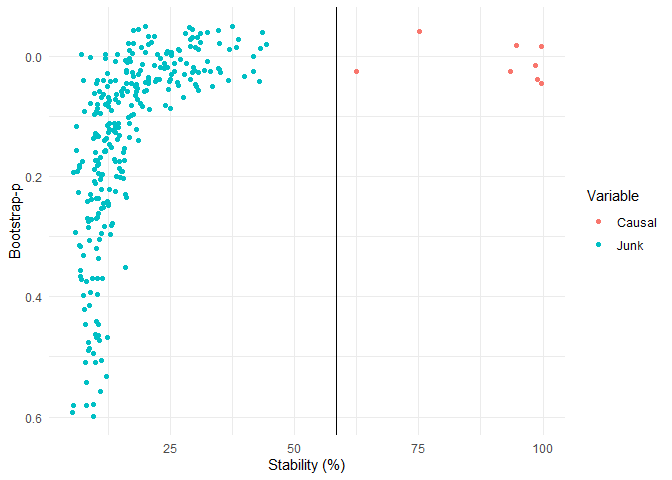

<!-- badges: start -->
<!-- badges: end -->

# Inferential modelling with wide data

## Introduction

Welcome to our workshop on inferential modelling with wide data. We hope
you enjoy the session.

This workshop will cover the problems associated with inferential
modelling of high dimensional, wide data, suggest approaches to overcome
them and provide hands-on training in the implementation of
regularisation techniques, covariate selection stability and
triangulation.

The following packages are required for these exercises.

``` r
library(Hmisc)
library(broom)
library(glmnet)
library(ncvreg)
library(bigstep)
library(rsample)
library(tidyverse)
library(stabiliser)
```

## Simulating data

In order to appreciate the issues we will be discussing today, we have
provided functions to simulate datasets for exploration.

The following function generates a dataset with “ncols” as the number of
variables and “nrows” as the number of rows.

``` r
generate_uncor_variables <- function(ncols, nrows) {
  data.frame(replicate(ncols, rnorm(nrows, 0, 1)))
}
```

A dataset with 197 rows and 130 variables can then be generated using
this function as follows:

``` r
variables <- generate_uncor_variables(ncols = 130, nrows = 197)
```

This results in the following dataset being generated:

``` r
variables %>%
  as_tibble()
```

    ## # A tibble: 197 x 130
    ##         X1     X2      X3     X4      X5     X6      X7     X8      X9     X10
    ##      <dbl>  <dbl>   <dbl>  <dbl>   <dbl>  <dbl>   <dbl>  <dbl>   <dbl>   <dbl>
    ##  1 -2.58    1.05  -0.332  -0.644 -0.691  -0.635  0.468   0.555  1.63    0.900 
    ##  2 -0.802   0.463  0.0574  1.09  -0.612   1.11   1.18   -1.84  -0.0314  0.356 
    ##  3 -0.385  -0.879 -1.88   -0.404 -0.123   0.455  0.356  -0.869  1.86    0.782 
    ##  4 -0.770  -0.466 -1.05    2.32   0.384   0.634  1.82   -1.89   0.810  -1.42  
    ##  5  0.436   0.124 -0.559  -0.112  1.41   -1.64   0.275   1.14  -2.02   -1.31  
    ##  6  0.285  -1.21   0.224   0.541  0.212   2.00  -0.0174  0.292  0.492   1.11  
    ##  7  0.124   0.376 -0.877   1.34   0.814  -1.78  -2.39    0.158 -0.441   0.679 
    ##  8 -1.86   -0.853 -0.288   1.89   0.0454 -0.211 -0.496   0.712  1.26    0.753 
    ##  9  1.03   -0.896  0.339   0.976  0.134   0.655  0.917  -1.07   0.352   0.0244
    ## 10 -0.0552 -0.458 -1.60   -1.47  -1.63   -0.266  1.29    1.30   0.209   0.0627
    ## # ... with 187 more rows, and 120 more variables: X11 <dbl>, X12 <dbl>,
    ## #   X13 <dbl>, X14 <dbl>, X15 <dbl>, X16 <dbl>, X17 <dbl>, X18 <dbl>,
    ## #   X19 <dbl>, X20 <dbl>, X21 <dbl>, X22 <dbl>, X23 <dbl>, X24 <dbl>,
    ## #   X25 <dbl>, X26 <dbl>, X27 <dbl>, X28 <dbl>, X29 <dbl>, X30 <dbl>,
    ## #   X31 <dbl>, X32 <dbl>, X33 <dbl>, X34 <dbl>, X35 <dbl>, X36 <dbl>,
    ## #   X37 <dbl>, X38 <dbl>, X39 <dbl>, X40 <dbl>, X41 <dbl>, X42 <dbl>,
    ## #   X43 <dbl>, X44 <dbl>, X45 <dbl>, X46 <dbl>, X47 <dbl>, X48 <dbl>, ...

We can also generate an outcome variable, in this case randomly
generated in the same manner, but renaming as “outcome”

``` r
generate_uncor_outcome <- function(nrows) {
  data.frame(replicate(1, rnorm(nrows, 0, 1))) %>%
    rename("outcome" = 1)
}

outcome <- generate_uncor_outcome(nrows = 197)

outcome %>%
  as_tibble()
```

    ## # A tibble: 197 x 1
    ##    outcome
    ##      <dbl>
    ##  1  0.626 
    ##  2  1.29  
    ##  3  0.640 
    ##  4  0.0644
    ##  5 -0.862 
    ##  6 -0.454 
    ##  7 -0.871 
    ##  8  0.625 
    ##  9  0.437 
    ## 10 -2.37  
    ## # ... with 187 more rows

We can now bind together the uncorrelated, randomly generated variables,
with the randomly generated outcome.

``` r
df_no_signal <- outcome %>%
  bind_cols(variables)
```

This results in a dataset of 197 rows, with a single outcome variable,
which has no relationship to the 130 columns as shown below.

``` r
df_no_signal %>%
  as_tibble()
```

    ## # A tibble: 197 x 131
    ##    outcome      X1     X2      X3     X4      X5     X6      X7     X8      X9
    ##      <dbl>   <dbl>  <dbl>   <dbl>  <dbl>   <dbl>  <dbl>   <dbl>  <dbl>   <dbl>
    ##  1  0.626  -2.58    1.05  -0.332  -0.644 -0.691  -0.635  0.468   0.555  1.63  
    ##  2  1.29   -0.802   0.463  0.0574  1.09  -0.612   1.11   1.18   -1.84  -0.0314
    ##  3  0.640  -0.385  -0.879 -1.88   -0.404 -0.123   0.455  0.356  -0.869  1.86  
    ##  4  0.0644 -0.770  -0.466 -1.05    2.32   0.384   0.634  1.82   -1.89   0.810 
    ##  5 -0.862   0.436   0.124 -0.559  -0.112  1.41   -1.64   0.275   1.14  -2.02  
    ##  6 -0.454   0.285  -1.21   0.224   0.541  0.212   2.00  -0.0174  0.292  0.492 
    ##  7 -0.871   0.124   0.376 -0.877   1.34   0.814  -1.78  -2.39    0.158 -0.441 
    ##  8  0.625  -1.86   -0.853 -0.288   1.89   0.0454 -0.211 -0.496   0.712  1.26  
    ##  9  0.437   1.03   -0.896  0.339   0.976  0.134   0.655  0.917  -1.07   0.352 
    ## 10 -2.37   -0.0552 -0.458 -1.60   -1.47  -1.63   -0.266  1.29    1.30   0.209 
    ## # ... with 187 more rows, and 121 more variables: X10 <dbl>, X11 <dbl>,
    ## #   X12 <dbl>, X13 <dbl>, X14 <dbl>, X15 <dbl>, X16 <dbl>, X17 <dbl>,
    ## #   X18 <dbl>, X19 <dbl>, X20 <dbl>, X21 <dbl>, X22 <dbl>, X23 <dbl>,
    ## #   X24 <dbl>, X25 <dbl>, X26 <dbl>, X27 <dbl>, X28 <dbl>, X29 <dbl>,
    ## #   X30 <dbl>, X31 <dbl>, X32 <dbl>, X33 <dbl>, X34 <dbl>, X35 <dbl>,
    ## #   X36 <dbl>, X37 <dbl>, X38 <dbl>, X39 <dbl>, X40 <dbl>, X41 <dbl>,
    ## #   X42 <dbl>, X43 <dbl>, X44 <dbl>, X45 <dbl>, X46 <dbl>, X47 <dbl>, ...

## Conventional approaches

### Univariable prefiltration

The following function conducts univariable analysis to determine the
association between a given variable and the outcome. A pearson/spearman
rank correlation matrix is another option for this.

``` r
univariable_analysis <- function(data, variable) {
  data %>%
    lm(outcome ~ variable, .) %>%
    tidy() %>%
    filter(term != "(Intercept)")
}
```

This function can then be applied using map_df() to each column of the
dataset individually and return a dataframe.

``` r
univariable_outcomes <- map_df(df_no_signal, ~ univariable_analysis(data = df_no_signal, variable = .), .id = "variable")
```

A conventional approach would then filter at a given threshold (for
example P\<0.2).

``` r
univariable_outcomes_filtered <- univariable_outcomes %>%
  filter(p.value < 0.2)
```

### Stepwise regression

This results in a table below of all of the variables that have a
p-value of \<0.2 to be carried forward into a multivariable model.

``` r
univariable_outcomes_filtered %>%
  as_tibble()
```

    ## # A tibble: 25 x 6
    ##    variable term     estimate std.error statistic p.value
    ##    <chr>    <chr>       <dbl>     <dbl>     <dbl>   <dbl>
    ##  1 outcome  variable   1       1.14e-17   8.79e16  0     
    ##  2 X6       variable   0.117   7.51e- 2   1.56e 0  0.120 
    ##  3 X11      variable  -0.109   7.56e- 2  -1.44e 0  0.152 
    ##  4 X16      variable   0.146   6.58e- 2   2.23e 0  0.0272
    ##  5 X22      variable   0.139   6.97e- 2   2.00e 0  0.0473
    ##  6 X23      variable   0.0999  6.55e- 2   1.52e 0  0.129 
    ##  7 X24      variable   0.135   6.93e- 2   1.95e 0  0.0526
    ##  8 X26      variable  -0.122   6.99e- 2  -1.74e 0  0.0837
    ##  9 X34      variable   0.106   6.79e- 2   1.56e 0  0.120 
    ## 10 X41      variable  -0.120   7.18e- 2  -1.68e 0  0.0953
    ## # ... with 15 more rows

A list of variables to be included is as follows:

``` r
variables_for_stepwise <- univariable_outcomes_filtered %>%
  pull(variable)
```

These variables would subsequently be offered into a stepwise selection
process such as the following

``` r
stepwise_model <- function(data, variables) {
  data_selected <- data %>%
    select(variables)

  lm(outcome ~ ., data = data_selected) %>%
    step(., direction = "backward", trace = FALSE) %>%
    tidy() %>%
    filter(p.value < 0.05) %>%
    rename(variable = term)
}

prefiltration_results <- stepwise_model(data = df_no_signal, variables = variables_for_stepwise)

prefiltration_results %>%
  as_tibble()
```

    ## # A tibble: 5 x 5
    ##   variable estimate std.error statistic p.value
    ##   <chr>       <dbl>     <dbl>     <dbl>   <dbl>
    ## 1 X24         0.133    0.0654      2.03  0.0439
    ## 2 X41        -0.147    0.0678     -2.17  0.0311
    ## 3 X76        -0.129    0.0641     -2.02  0.0449
    ## 4 X106        0.177    0.0689      2.57  0.0110
    ## 5 X120        0.149    0.0640      2.33  0.0207

## Data with a true signal

We will test a variety of models on this dataset. For future comparison
let’s set up a list where we can store model results

``` r
model_results <- list()
```

We will also want to explore some simulated datasets with a true signal;
i.e., some of the variables in our dataset are truly associated with the
outcome.

The following function generates a dataset with *nrow* rows and *ncol*
variables, of which *n_causal_vars* variables are truly associated with
the outcome with a signal strength of *amplitude*.

``` r
generate_data_with_signal <- function(nrow, ncol, n_causal_vars, amplitude) {
  # Generate the variables from a multivariate normal distribution
  mu <- rep(0, ncol)
  rho <- 0.25
  sigma <- toeplitz(rho^(0:(ncol - 1))) #  Symmetric Toeplitz Matrix
  X <- matrix(rnorm(nrow * ncol), nrow) %*% chol(sigma) # multiply matrices Choleski Decomposition. Description. Compute the Choleski factorization of a real symmetric positive-definite square matrix)

  # Generate the response from a linear model
  nonzero <- sample(ncol, n_causal_vars) # select the id of 'true' variables
  beta <- amplitude * (1:ncol %in% nonzero) / sqrt(nrow) # vector of effect sizes to pick out true varaiables
  beta_value <- amplitude / sqrt(nrow)
  outcome.sample <- function(X) X %*% beta + rnorm(nrow) # calculate outcome from true vars and error
  outcome <- outcome.sample(X)

  ## Rename true variables
  X_data <- as.data.frame(X)
  for (i in c(nonzero)) {
    X_data1 <- X_data %>%
      rename_with(.cols = i, ~ paste("causal_", i, sep = ""))
    X_data <- X_data1
  }

  dataset_sim <- as.data.frame(cbind(outcome, X_data1))
}
```

We can now simulate a dataset df_signal with 300 rows and 300 variables,
8 of which have a relationship with the outcome.

We can also alter the signal strength of causal variables by changing
the *amplitute* paramater.

``` r
df_signal <- generate_data_with_signal(nrow = 300, ncol = 300, n_causal_vars = 8, amplitude = 7)
```

## “Cheat” model

As we have simulated this dataset, we can “cheat” and create the perfect
model to check everything’s worked correctly.

``` r
df_signal %>%
  select(outcome, contains("causal_")) %>%
  lm(outcome~., data=.) %>%
  tidy()
```

    ## # A tibble: 9 x 5
    ##   term        estimate std.error statistic  p.value
    ##   <chr>          <dbl>     <dbl>     <dbl>    <dbl>
    ## 1 (Intercept)   0.0248    0.0602     0.411 6.81e- 1
    ## 2 causal_21     0.468     0.0608     7.69  2.27e-13
    ## 3 causal_31     0.418     0.0614     6.80  5.99e-11
    ## 4 causal_117    0.357     0.0594     6.01  5.48e- 9
    ## 5 causal_140    0.431     0.0631     6.83  4.90e-11
    ## 6 causal_200    0.383     0.0589     6.51  3.20e-10
    ## 7 causal_256    0.237     0.0600     3.95  9.76e- 5
    ## 8 causal_278    0.433     0.0633     6.83  4.84e-11
    ## 9 causal_286    0.492     0.0621     7.93  4.75e-14

## Conventional stepwise approach

We can now repeat out prefiltration and stepwise selection approach as
before

``` r
univariable_outcomes <- map_df(df_signal, ~ univariable_analysis(data = df_signal, variable = .), .id = "variable")
univariable_outcomes_filtered <- univariable_outcomes %>%
  filter(p.value < 0.2)
variables_for_stepwise <- univariable_outcomes_filtered %>%
  pull(variable)
model_results$prefiltration <- stepwise_model(data = df_signal, variables = variables_for_stepwise)
model_results$prefiltration %>%
  as_tibble()
```

    ## # A tibble: 22 x 5
    ##    variable  estimate std.error statistic  p.value
    ##    <chr>        <dbl>     <dbl>     <dbl>    <dbl>
    ##  1 causal_21    0.433    0.0597      7.26 4.49e-12
    ##  2 V23          0.136    0.0646      2.11 3.56e- 2
    ##  3 V28         -0.166    0.0540     -3.07 2.35e- 3
    ##  4 V29          0.120    0.0591      2.04 4.27e- 2
    ##  5 causal_31    0.316    0.0582      5.42 1.34e- 7
    ##  6 V52          0.172    0.0595      2.89 4.16e- 3
    ##  7 V68         -0.120    0.0565     -2.12 3.52e- 2
    ##  8 V91         -0.163    0.0521     -3.13 1.94e- 3
    ##  9 V103        -0.121    0.0568     -2.13 3.40e- 2
    ## 10 V105         0.135    0.0593      2.28 2.36e- 2
    ## # ... with 12 more rows

## Regularisation

There are several regularisation methods available. Here, we will use
the lasso. The following function enables the use of the lasso algorithm
from the *glmnet* package.

``` r
model_lasso <- function(data) {
  y_temp <- data %>%
    select("outcome") %>%
    as.matrix()

  x_temp <- data %>%
    select(-"outcome") %>%
    as.matrix()

  fit_lasso <- cv.glmnet(x = x_temp, y = y_temp, alpha = 1)

  coefs <- coef(fit_lasso, s = "lambda.min")

  data.frame(name = coefs@Dimnames[[1]][coefs@i + 1], coefficient = coefs@x) %>%
    rename(
      variable = name,
      estimate = coefficient
    ) %>%
    filter(variable != "(Intercept)") %>%
    select(variable, estimate)
}

model_results$lasso <- model_lasso(df_signal)
```

MCP can also be used in a similar manner using the *ncvreg* package.

``` r
model_mcp <- function(data) {
  y_temp <- data %>%
    select("outcome") %>%
    as.matrix()

  x_temp <- data %>%
    select(-"outcome")

  fit_mcp <- cv.ncvreg(X = x_temp, y = y_temp)

  fit_mcp %>%
    coef() %>%
    as_tibble(rownames = "variable") %>%
    rename(
      estimate = value
    ) %>%
    filter(
      variable != "(Intercept)",
      estimate != 0,
      !grepl("(Intercept)", variable),
      !grepl("Xm[, -1]", variable)
    ) %>%
    mutate(variable = str_remove_all(variable, "`"))
}

model_results$mcp <- model_mcp(df_signal)
```

MBIC can also be used from the *bigstep* package

``` r
model_mbic <- function(data) {
  y_temp <- data %>%
    select("outcome") %>%
    as.matrix()

  x_temp <- data %>%
    select(-"outcome")

  bigstep_prepped <- bigstep::prepare_data(y_temp, x_temp, verbose = FALSE)

  bigstep_prepped %>%
    reduce_matrix(minpv = 0.01) %>%
    fast_forward(crit = mbic) %>%
    multi_backward(crit = mbic) %>%
    summary() %>%
    stats::coef() %>%
    as.data.frame() %>%
    rownames_to_column(., var = "variable") %>%
    mutate(variable = str_remove_all(variable, "`")) %>%
    filter(
      !grepl("(Intercept)", variable),
      !grepl("Xm[, -1]", variable)
    ) %>%
    rename(estimate = Estimate) %>%
    select(variable, estimate)
}

model_results$mbic <- model_mbic(df_signal)
```

A comparison of the number of True/False positives is shown below, by
using a *calculate_tp_fp()* function.

``` r
calculate_tp_fp <- function(results) {
  results %>%
    mutate(causal = case_when(
      grepl("causal", variable) ~ "tp",
      !grepl("causal", variable) ~ "fp"
    )) %>%
    group_by(model) %>%
    summarise(
      tp = sum(causal == "tp", na.rm = TRUE),
      fp = sum(causal == "fp", na.rm = TRUE)
    ) %>%
    mutate("total_selected" = tp + fp)
}

conventional_results <- model_results %>%
  bind_rows(., .id = "model") %>%
  calculate_tp_fp()

conventional_results
```

    ## # A tibble: 4 x 4
    ##   model            tp    fp total_selected
    ##   <chr>         <int> <int>          <int>
    ## 1 lasso             8    10             18
    ## 2 mbic              6     0              6
    ## 3 mcp               8     2             10
    ## 4 prefiltration     8    14             22

## Stability selection

Stability selection relies heavily on bootstrapping. An example of the
bootstrapping approach is shown below (in reality 100-200 bootstrap
resamples might be conducted).

``` r
boot_sample <- function(data, boot_reps) {
  rsample::bootstraps(data, boot_reps)
}

bootstrapped_datasets <- boot_sample(data = df_signal, boot_reps = 10)
```

Bootstrapped data is presented here as a table of 10 different nested
tables.

``` r
bootstrapped_datasets
```

    ## # Bootstrap sampling 
    ## # A tibble: 10 x 2
    ##    splits            id         
    ##    <list>            <chr>      
    ##  1 <split [300/115]> Bootstrap01
    ##  2 <split [300/120]> Bootstrap02
    ##  3 <split [300/115]> Bootstrap03
    ##  4 <split [300/120]> Bootstrap04
    ##  5 <split [300/99]>  Bootstrap05
    ##  6 <split [300/111]> Bootstrap06
    ##  7 <split [300/105]> Bootstrap07
    ##  8 <split [300/104]> Bootstrap08
    ##  9 <split [300/107]> Bootstrap09
    ## 10 <split [300/107]> Bootstrap10

If we extract a single bootstrapped dataset and sort by the outcome, we
can see that several rows have been resampled. Consequently as the
dataset length is the same as the original, several rows will be omitted
completely.

``` r
bootstrapped_datasets$splits[[1]] %>%
  as_tibble() %>%
  arrange(outcome)
```

    ## # A tibble: 300 x 301
    ##    outcome      V1     V2       V3     V4      V5     V6     V7      V8      V9
    ##      <dbl>   <dbl>  <dbl>    <dbl>  <dbl>   <dbl>  <dbl>  <dbl>   <dbl>   <dbl>
    ##  1   -4.37  0.860  -0.877  0.105    0.380 -0.639  -1.01   1.16   0.439  -0.382 
    ##  2   -3.92 -0.908  -1.33   0.604    2.19   1.98   -2.14  -0.470  0.118  -0.0788
    ##  3   -3.75 -0.937  -1.07   0.00104 -0.131  0.0219 -0.233  1.40   1.43    0.250 
    ##  4   -3.75 -0.937  -1.07   0.00104 -0.131  0.0219 -0.233  1.40   1.43    0.250 
    ##  5   -3.65  0.395  -1.31  -0.709   -0.134  0.578   1.50   1.95   0.247   0.964 
    ##  6   -3.00 -0.566  -0.732 -0.795   -0.565  0.424  -0.777 -0.725 -0.455  -0.989 
    ##  7   -2.97  0.0285  0.824  0.121    0.855 -0.961   2.52  -0.735  0.0419 -1.05  
    ##  8   -2.88 -0.872  -0.823 -2.38     0.957  0.978  -0.884 -1.21   1.02   -1.40  
    ##  9   -2.88 -0.872  -0.823 -2.38     0.957  0.978  -0.884 -1.21   1.02   -1.40  
    ## 10   -2.60 -1.08    0.176  0.256   -1.73  -0.124   1.10   0.496  0.814   0.484 
    ## # ... with 290 more rows, and 291 more variables: V10 <dbl>, V11 <dbl>,
    ## #   V12 <dbl>, V13 <dbl>, V14 <dbl>, V15 <dbl>, V16 <dbl>, V17 <dbl>,
    ## #   V18 <dbl>, V19 <dbl>, V20 <dbl>, causal_21 <dbl>, V22 <dbl>, V23 <dbl>,
    ## #   V24 <dbl>, V25 <dbl>, V26 <dbl>, V27 <dbl>, V28 <dbl>, V29 <dbl>,
    ## #   V30 <dbl>, causal_31 <dbl>, V32 <dbl>, V33 <dbl>, V34 <dbl>, V35 <dbl>,
    ## #   V36 <dbl>, V37 <dbl>, V38 <dbl>, V39 <dbl>, V40 <dbl>, V41 <dbl>,
    ## #   V42 <dbl>, V43 <dbl>, V44 <dbl>, V45 <dbl>, V46 <dbl>, V47 <dbl>, ...

## Model for bootstraps

We can apply our previous lasso function over each one of these
bootstrapped resamples.

``` r
model_lasso_bootstrapped <- bootstrapped_datasets %>%
  map_df(.x = .$splits, .f = ~ as.data.frame(.) %>% model_lasso(.), .id = "bootstrap")
```

## Permutation

To identify a null threshold, first we must permute the outcome.

Our original dataset looks like this:

``` r
df_signal %>%
  as_tibble()
```

    ## # A tibble: 300 x 301
    ##    outcome      V1     V2     V3      V4      V5     V6     V7      V8      V9
    ##      <dbl>   <dbl>  <dbl>  <dbl>   <dbl>   <dbl>  <dbl>  <dbl>   <dbl>   <dbl>
    ##  1  -3.65   0.395  -1.31  -0.709 -0.134   0.578   1.50   1.95   0.247   0.964 
    ##  2  -0.138 -0.242   1.40  -0.525 -0.0913  0.461   0.340 -0.525 -0.0688 -1.60  
    ##  3   0.404 -0.268   1.01   0.591 -0.671  -0.0944 -0.106 -1.54  -0.0679  0.0840
    ##  4   3.91   1.20    1.02  -1.06  -1.45    0.221   0.729  1.49   1.58    2.04  
    ##  5  -2.23   0.678  -0.419  0.151 -1.08   -1.68    1.44   1.04   0.494  -0.546 
    ##  6  -2.23  -0.102   1.02   0.198  0.704  -0.243  -0.488  0.268  1.14    0.171 
    ##  7  -0.642 -0.0508 -0.588 -0.797 -1.04   -0.138   1.81  -0.187  0.819   0.689 
    ##  8   0.256 -0.162   1.12   1.16   1.65    1.39   -1.07   1.28   1.53    0.590 
    ##  9   1.50   1.62   -0.314  2.46   1.21    1.94    0.366  0.987 -1.40    0.726 
    ## 10   0.921  0.258   0.558  1.61  -0.639   0.324  -0.396  0.762  1.51    1.09  
    ## # ... with 290 more rows, and 291 more variables: V10 <dbl>, V11 <dbl>,
    ## #   V12 <dbl>, V13 <dbl>, V14 <dbl>, V15 <dbl>, V16 <dbl>, V17 <dbl>,
    ## #   V18 <dbl>, V19 <dbl>, V20 <dbl>, causal_21 <dbl>, V22 <dbl>, V23 <dbl>,
    ## #   V24 <dbl>, V25 <dbl>, V26 <dbl>, V27 <dbl>, V28 <dbl>, V29 <dbl>,
    ## #   V30 <dbl>, causal_31 <dbl>, V32 <dbl>, V33 <dbl>, V34 <dbl>, V35 <dbl>,
    ## #   V36 <dbl>, V37 <dbl>, V38 <dbl>, V39 <dbl>, V40 <dbl>, V41 <dbl>,
    ## #   V42 <dbl>, V43 <dbl>, V44 <dbl>, V45 <dbl>, V46 <dbl>, V47 <dbl>, ...

By permuting the outcome variable we sever all ties between the outcome
and the explanatory variables. We might want to conduct this 5 times.

``` r
permuted_datasets <- rsample::permutations(data = df_signal, permute = outcome, times = 5)
```

A single dataset would look like this. Note the structure of the
explanatory variables remains the same, but the outcome is randomly
shuffled.

``` r
permuted_datasets$splits[[1]] %>%
  as_tibble()
```

    ## # A tibble: 300 x 301
    ##    outcome      V1     V2     V3      V4      V5     V6     V7      V8      V9
    ##      <dbl>   <dbl>  <dbl>  <dbl>   <dbl>   <dbl>  <dbl>  <dbl>   <dbl>   <dbl>
    ##  1   0.434  0.395  -1.31  -0.709 -0.134   0.578   1.50   1.95   0.247   0.964 
    ##  2  -1.62  -0.242   1.40  -0.525 -0.0913  0.461   0.340 -0.525 -0.0688 -1.60  
    ##  3  -2.38  -0.268   1.01   0.591 -0.671  -0.0944 -0.106 -1.54  -0.0679  0.0840
    ##  4  -1.02   1.20    1.02  -1.06  -1.45    0.221   0.729  1.49   1.58    2.04  
    ##  5   0.627  0.678  -0.419  0.151 -1.08   -1.68    1.44   1.04   0.494  -0.546 
    ##  6   1.92  -0.102   1.02   0.198  0.704  -0.243  -0.488  0.268  1.14    0.171 
    ##  7   0.399 -0.0508 -0.588 -0.797 -1.04   -0.138   1.81  -0.187  0.819   0.689 
    ##  8   0.156 -0.162   1.12   1.16   1.65    1.39   -1.07   1.28   1.53    0.590 
    ##  9   2.46   1.62   -0.314  2.46   1.21    1.94    0.366  0.987 -1.40    0.726 
    ## 10  -2.32   0.258   0.558  1.61  -0.639   0.324  -0.396  0.762  1.51    1.09  
    ## # ... with 290 more rows, and 291 more variables: V10 <dbl>, V11 <dbl>,
    ## #   V12 <dbl>, V13 <dbl>, V14 <dbl>, V15 <dbl>, V16 <dbl>, V17 <dbl>,
    ## #   V18 <dbl>, V19 <dbl>, V20 <dbl>, causal_21 <dbl>, V22 <dbl>, V23 <dbl>,
    ## #   V24 <dbl>, V25 <dbl>, V26 <dbl>, V27 <dbl>, V28 <dbl>, V29 <dbl>,
    ## #   V30 <dbl>, causal_31 <dbl>, V32 <dbl>, V33 <dbl>, V34 <dbl>, V35 <dbl>,
    ## #   V36 <dbl>, V37 <dbl>, V38 <dbl>, V39 <dbl>, V40 <dbl>, V41 <dbl>,
    ## #   V42 <dbl>, V43 <dbl>, V44 <dbl>, V45 <dbl>, V46 <dbl>, V47 <dbl>, ...

We can then apply our bootstrap function to each one of these 5 permuted
datasets. We might perform 3 bootstrap samples for each of the 5
permuted datasets for this example (this is typically 20 bootstraps for
each of 5 permutations in reality). The model would then be applied to
each dataset within the following table.

``` r
permuted_bootstrapped_datasets <- permuted_datasets %>%
  map_df(.x = .$splits, .f = ~ as.data.frame(.) %>% boot_sample(., boot_reps = 3), .id = "permutation")

permuted_bootstrapped_datasets
```

    ## # A tibble: 15 x 3
    ##    permutation splits            id        
    ##    <chr>       <list>            <chr>     
    ##  1 1           <split [300/112]> Bootstrap1
    ##  2 1           <split [300/113]> Bootstrap2
    ##  3 1           <split [300/108]> Bootstrap3
    ##  4 2           <split [300/107]> Bootstrap1
    ##  5 2           <split [300/111]> Bootstrap2
    ##  6 2           <split [300/107]> Bootstrap3
    ##  7 3           <split [300/106]> Bootstrap1
    ##  8 3           <split [300/104]> Bootstrap2
    ##  9 3           <split [300/114]> Bootstrap3
    ## 10 4           <split [300/111]> Bootstrap1
    ## 11 4           <split [300/112]> Bootstrap2
    ## 12 4           <split [300/111]> Bootstrap3
    ## 13 5           <split [300/110]> Bootstrap1
    ## 14 5           <split [300/113]> Bootstrap2
    ## 15 5           <split [300/115]> Bootstrap3

This code is relatively lengthy, and is therefore deliberately omitted
from the workshop, however is present within the *stabiliser* package
and freely available at www.github.com/roberthyde/stabiliser.

Using the ecdf() function, the stability of each variable within each
permutation can be calculated.

By choosing the value where quantile(., probs=1), the highest stability
that might have occurred by chance can be calculated.

The mean threshold across all permutations can then be calculated. This
represents the “null threshold”; i.e., the mean highest stability a
variable might acheive across all permuted datasets (where we know there
should be no links between variables and outcome).

Variables in the true model (i.e., non-permuted data) that have a
stability value in excess of this null threshold are highly likely to be
truly correlated with the outcome.

## The *stabiliser* approach

The goal of the *stabiliser* package is to provide a flexible method of
applying stability selection (Meinshausen and Buhlmann, 2010) with
various model types, and the framework for triangulating the results for
multiple models (Lima et al., 2021).

-   `stabilise()` performs stability selection on a range of models to
    identify causal models.
-   `triangulate()` identifies which variables are most likely to be
    causal across all models.
-   `stab_plot()` allows visualisation of either `stabilise()` or
    `triangulate()` outputs.

To attempt to identify which variables are truly “causal” in this
dataset using a selection stability approach, use the `stabilise()`
function as follows:

``` r
stab_output <- stabilise(outcome = "outcome", data = df_signal, models = c("mbic"), type = "linear")
```

Access the stability (percentage of bootstrap resamples where a given
variable was selected by a given model) results for elastic net as
follows:

``` r
stab_output$mbic$stability
```

    ## # A tibble: 301 x 7
    ##    variable   mean_coefficient ci_lower ci_upper bootstrap_p stability stable
    ##    <chr>                 <dbl>    <dbl>    <dbl>       <dbl>     <dbl> <chr> 
    ##  1 causal_21             0.465    0.330    0.632           0       100 *     
    ##  2 causal_286            0.474    0.352    0.606           0       100 *     
    ##  3 causal_140            0.447    0.308    0.597           0        95 *     
    ##  4 causal_31             0.397    0.271    0.522           0        95 *     
    ##  5 causal_117            0.362    0.266    0.481           0        90 *     
    ##  6 causal_278            0.411    0.296    0.531           0        73 *     
    ##  7 causal_200            0.379    0.293    0.458           0        53 *     
    ##  8 causal_256            0.304    0.237    0.418           0        30 *     
    ##  9 V252                  0.279    0.242    0.324           0         9 <NA>  
    ## 10 V257                  0.275    0.232    0.326           0         9 <NA>  
    ## # ... with 291 more rows

This ranks the variables by stability, and displays the mean
coefficients, 95% confidence interval and bootstrap p-value. It also
displays whether the variable is deemed “stable”.

By default, this implements an elastic net algorithm over a number of
bootstrap resamples of the dataset (200 resamples for small datasets).
The stability of each variable is then calculated as the proportion of
bootstrap repeats where that variable is selected in the model.

`stabilise()` also permutes the outcome several times (10 by default for
small datasets) and performs the same process on each permuted dataset
(20 bootstrap resamples for each by default).

This allows a permutation threshold to be calculated. Variables with a
non-permuted stability % above this threshold are deemed “stable” as
they were selected in a higher proportion of bootstrap resamples than in
the permuted datasets, where we know there is no association between
variables and the outcome.

The permutation threshold is available as follows:

``` r
stab_output$mbic$perm_thresh
```

    ## [1] 23

The *stabiliser* package allows multiple models to be run
simultaneously. Just select the models you wish to run in the “models”
argument.

MCP is omitted here for speed. To include it, just add it to the list of
models using: models = c(“mbic”, “lasso”, “mcp”)

``` r
stab_output <- stabilise(outcome = "outcome", data = df_signal, models = c("mbic", "lasso"), type = "linear")
```

## Results

Calculate the number of true and false positives selected through
stability approaches, and rename columns to include “\_stability”.

``` r
stability_results <- stab_output %>%
  map_df(., ~ .x$stability, .id = "model") %>%
  filter(stable == "*") %>%
  calculate_tp_fp(.) %>%
  rename_all(., ~ paste0(., "_stability"))

stability_results
```

    ## # A tibble: 2 x 4
    ##   model_stability tp_stability fp_stability total_selected_stability
    ##   <chr>                  <int>        <int>                    <int>
    ## 1 lasso                      7            0                        7
    ## 2 mbic                       8            0                        8

Compare this with the non-stability approach

``` r
conventional_results %>%
  left_join(stability_results, by = c("model" = "model_stability"))
```

    ## # A tibble: 4 x 7
    ##   model      tp    fp total_selected tp_stability fp_stability total_selected_s~
    ##   <chr>   <int> <int>          <int>        <int>        <int>             <int>
    ## 1 lasso       8    10             18            7            0                 7
    ## 2 mbic        6     0              6            8            0                 8
    ## 3 mcp         8     2             10           NA           NA                NA
    ## 4 prefil~     8    14             22           NA           NA                NA

# Triangulation

Our confidence that a given variable is truly associated with a given
outcome might be increased if it is identified in multiple model types.

The *stabiliser* package allows the stability selection results from
multiple models to be used synergistically, and by leveraging the
strenghts of various models, a more robust method of variable selection
is often achieved.

``` r
triangulated_stability <- triangulate(stab_output)

triangulated_stability
```

    ## $combi
    ## $combi$stability
    ## # A tibble: 301 x 4
    ##    variable   stability bootstrap_p stable
    ##    <chr>          <dbl>       <dbl> <chr> 
    ##  1 causal_286      99.5           0 *     
    ##  2 causal_31       99.5           0 *     
    ##  3 causal_21       99             0 *     
    ##  4 causal_140      98.5           0 *     
    ##  5 causal_117      95             0 *     
    ##  6 causal_278      93             0 *     
    ##  7 causal_200      75             0 *     
    ##  8 causal_256      63             0 *     
    ##  9 V252            44.5           0 <NA>  
    ## 10 V203            44             0 <NA>  
    ## # ... with 291 more rows
    ## 
    ## $combi$perm_thresh
    ## [1] 58.5

``` r
stab_plot(triangulated_stability)
```

<!-- -->

## No signal datasets

We can now return to our original dataset that we simulated to have no
signal.

Our conventional approach performed relatively poorly, selecting the
following variables as being significantly associated with the outcome
variable.

``` r
prefiltration_results
```

    ## # A tibble: 5 x 5
    ##   variable estimate std.error statistic p.value
    ##   <chr>       <dbl>     <dbl>     <dbl>   <dbl>
    ## 1 X24         0.133    0.0654      2.03  0.0439
    ## 2 X41        -0.147    0.0678     -2.17  0.0311
    ## 3 X76        -0.129    0.0641     -2.02  0.0449
    ## 4 X106        0.177    0.0689      2.57  0.0110
    ## 5 X120        0.149    0.0640      2.33  0.0207

The `stabilise()` and `triangulate()` functions from the *stabiliser*
package can be used to perform stability selection with multiple models,
and utilise a robust threhsold to identify which variables are
associated with the outcome.

``` r
stab_output_no_signal <- stabilise(outcome = "outcome", data = df_no_signal, models = c("mbic", "lasso"), type = "linear")
triangulated_output_no_signal <- triangulate(stab_output_no_signal)
```

The following table includes all variables selected from the dataset
with no signal.

``` r
triangulated_output_no_signal$combi$stability %>%
  filter(stable == "*")
```

    ## # A tibble: 0 x 4
    ## # ... with 4 variables: variable <chr>, stability <dbl>, bootstrap_p <dbl>,
    ## #   stable <chr>

## Conclusions

Thank you for attending this workshop. We hope you enjoyed the session,
and have a good understanding of where some conventional modelling
approaches might not be appropriate in wider datasets.

If you have any further questions after the workshop, please feel free
to contact Martin Green (<martin.green@nottingham.ac.uk>) or Robert Hyde
(<robert.hyde4@nottingham.ac.uk>).
